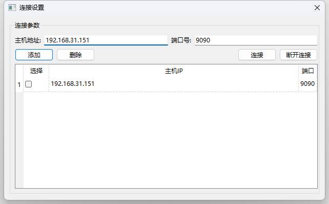

# 上位机

## 功能：

1. 数据通信
   
   基于rosBridge和QWebSocket进行ros和windows端qt软件的数据桥接，需解析与生成相关的JSON消息。

2. 机器人基本信息显示==TODO==

	从ros话题获取机器人位姿信息等。

3. 数字孪生显示==TODO==

	QGraphicsView显示机器人模型

## TODO:
1. 话题数据解析
2. 机器人信息显示
3. 3D模型显示

## 当前实现：

在roban上新开终端启动ros_bridge，qt程序上通过QWebSocket进行连接

```c++
 roslaunch rosbridge_server rosbridge_websocket.launch
```
点击主界面连接设置，进入连接设置界面，输入连接网络ipv4地址和端口号（ros_bridge默认端口9090），可通过添加将数据保存至数据库中，选中表单中的项，可对数据进行删除。

勾选需要连接的ip前的复选框，点击连接即可建立通信。连接成功，主界面左下方的状态栏显示已连接。

