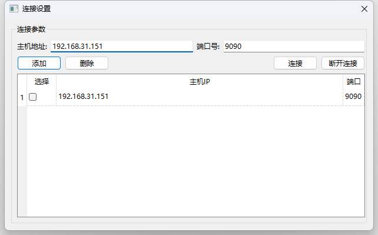
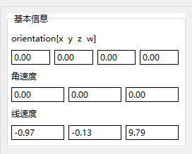
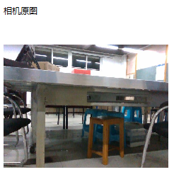

# 上位机

## 功能：

1. 数据通信
   
   基于rosBridge和QWebSocket进行ros和windows端qt软件的数据桥接，需解析与生成相关的JSON消息。

2. 机器人基本信息显示

	从ros话题获取机器人位姿信息等。

3. 数字孪生显示

	QGraphicsView显示机器人模型

## TODO:
1. 话题数据解析（能够解析，待加入更多功能）
2. 机器人信息显示
3. **接收"MediumSize/BodyHub/ServoPositions"话题数据，该话题不能持续输出，只有当程序退出后，才会显示中间的一些话题数据**
	暂定解决方案：修改BodyHubNode.cpp中的话题发布逻辑，使其在running状态持续发布话题
	
	
4. 3D模型显示

## 当前实现：

1.通信连接

在roban上新开终端启动ros_bridge，qt程序上通过QWebSocket进行连接

```c++
 roslaunch rosbridge_server rosbridge_websocket.launch
```
点击主界面连接设置，进入连接设置界面，输入连接网络ipv4地址和端口号（ros_bridge默认端口9090），可通过添加将数据保存至数据库中，选中表单中的项，可对数据进行删除。

勾选需要连接的ip前的复选框，点击连接即可建立通信。连接成功，主界面左下方的状态栏显示已连接。



2.电量显示
状态栏显示电池电量

3.IMU数据显示
右侧信息栏显示机器人位姿信息，包括oritention, linear_acceleration,angular_velocity



**TODO: oritention始终为0，需要在底层代码中进行处理**


4.相机图像显示
实时接收机器人相机数据进行显示



5.slam脚本启动


启动slam建图（rosrun SLAM RGBD true false）：适用于初次建图，点击关闭按钮，可结束建图并保存地图
定位模式（rosrun SLAM RGBD true true）：适用于在之前的地图上进行二次建图，点击关闭按钮，可结束建图并保存地图。

**TODO: 后续直接集成到一个按钮？？？**


**PS:需要在机器人的代码中新增python脚本（将need_add_python文件夹中的cmd_executor.py添加到机器人系统的~/robot_ros_application/catkin_ws/src/bodyhub/scripts中），并启动使其接受传过去的cmd指令**

初次添加需要进行编译
```
python3 -m py_compile /home/lemon/robot_ros_application/catkin_ws/src/bodyhub/scripts/cmd_executor.py
```
启动脚本
```
rosrun bodyhub cmd_executor.py 
```