# Roban上位机

## 功能：

1. 数据通信
   
    (1) 基于rosBridge和QWebSocket进行ros和windows端上位机的数据桥接

    (2) 机器人IP和端口信息数据库存储

2. 机器人基本信息

	(1) 从ros话题获取机器人位姿信息（oritation, lin_vel, ang_vel）

	(2) 实时显示机器人摄像头画面
	
	(3) SLAM建图定位模式和非定位模式切换，点云数据显示，特征点图显示

	(4) 机器人控制


3. 数字孪生显示

	机器人模型与实机行为的实时显示


## 使用教程

**重要！！！**

对于初次配置或者机器人重新刷了镜像，需要做以下**文件替换处理**

将need_change_code文件夹下的文件替换对应路径下的文件：

【1】bridge.sh和start.sh：/home/lemon/（即~/）

【2】其他.sh文件：~/exec_scripts(需要新建该文件夹)

【3】MapDrawer.cc、Viewer.cc和MapDrawer.h、Viewer.h：分别位于~/robot_ros_application/catkin_ws/src/SLAM/ORB_SLAM2文件夹下的src和include文件夹中

【4】SensorHubNode.py：/home/lemon/robot_ros_application/catkin_ws/src/sensorhub/scripts/SensorHubNode.py

【5】slam_map.py：~/robot_ros_application/catkin_ws/src/ros_actions_node/scripts/game/2022/caai_roban_challenge/colleges/scripts/slam_map.py


主界面

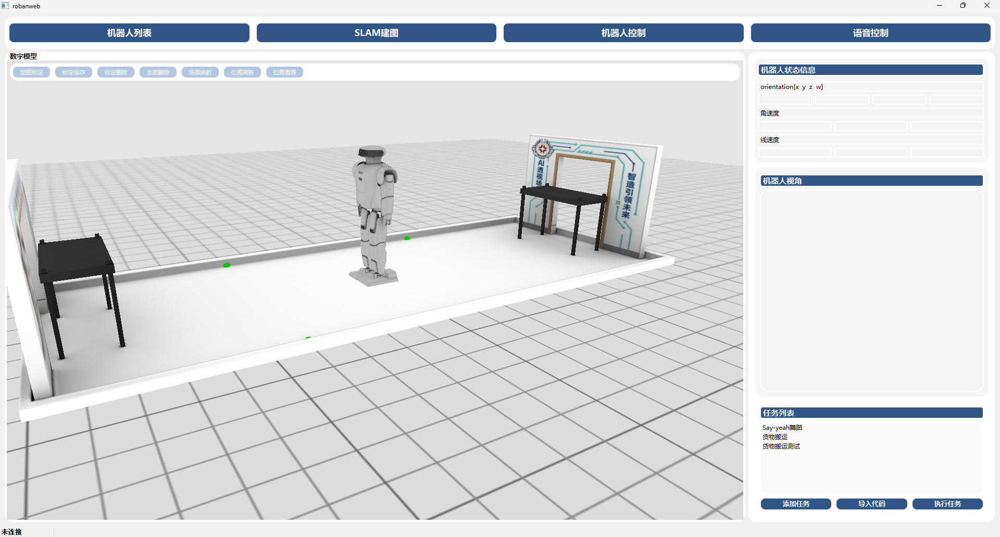

1.通信连接

启动机器人时，系统自启动start.sh脚本，脚本调用bridge.sh，启动rosbridge和接收执行sh脚本的命令程序cmd_executor.py，二者对应如下指令，若启动失败可以单独运行启动

```c++
 roslaunch rosbridge_server rosbridge_websocket.launch
 
 rosrun bodyhub cmd_executor.py
```

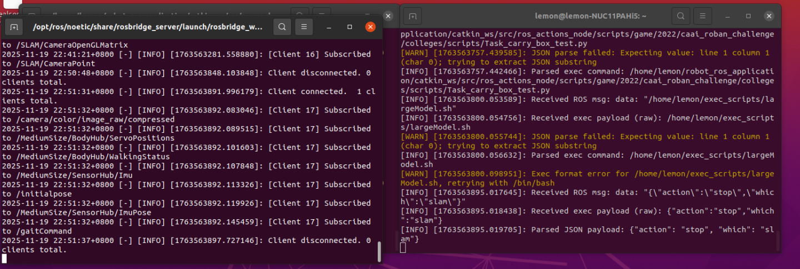

点击主界面连接设置，进入连接设置界面，输入连接网络ipv4地址和端口号（ros_bridge默认端口9090），可通过添加将数据保存至数据库中，选中表单中的项，可对数据进行删除。

勾选需要连接的ip前的复选框，点击连接即可建立通信。连接成功，主界面左下方的状态栏显示已连接。

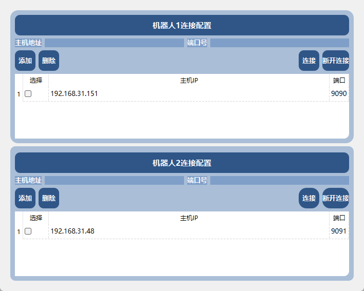


2.IMU数据显示

右侧信息栏显示机器人位姿信息，包括oritention, linear_acceleration,angular_velocity

将need_change_code中的SensorHubNode.py替换到机器人端的~/robot_ros_application/catkin_ws/src/sensorhub/scripts路径下的SensorHubNode.py,并**编译**

```
python3 -m py_compile /home/lemon/robot_ros_application/catkin_ws/src/sensorhub/scripts/SensorHubNode.py
```

4.相机图像显示

实时接收机器人相机数据进行显示

5.SLAM与控制启动

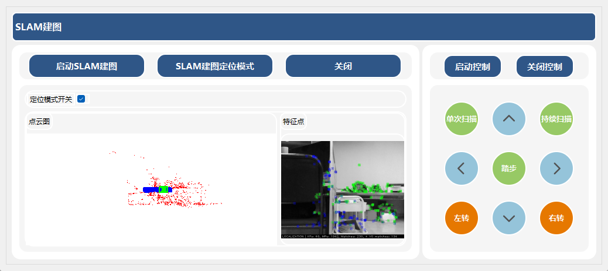

左侧界面为SLAM的初始建图模式、定位模式启动、关闭SLAM建图按钮，下方包括点云数据图和特征图显示

**运行前需要：**

将need_change_code文件夹下的MapDrawer.cc,Viewer.cc覆盖到机器人端的SLAM包下的ORB_SLAM2/src文件夹下的对应内容,MapDrawer.h和Viewer.h覆盖到ORB_SLAM2/include文件夹下。

重新编译SLAM包，若编译失败可执行下面指令

```
cd /home/lemon/robot_ros_application/catkin_ws && catkin_make -DCATKIN_WHITELIST_PACKAGES="" --force-cmake --pkg SLAM -j4
```

然后对相应的sh脚本进行读写权限修改
```
chmod +x /home/lemon/exec_scripts/slam.sh
chmod +x /home/lemon/exec_scripts/slam_tt.sh
chmod +x /home/lemon/exec_scripts/move.sh
```

将need_change_code文件夹中的cmd_executor.py添加到机器人系统的~/robot_ros_application/catkin_ws/src/bodyhub/scripts中），并启动使其接受传过去的cmd指令


初次添加需要进行编译
```
python3 -m py_compile /home/lemon/robot_ros_application/catkin_ws/src/bodyhub/scripts/cmd_executor.py
```

启动指令执行脚本,开机会自启动，如果启动失败可以手动执行以下命令
```
rosrun bodyhub cmd_executor.py 
```

**使用：**


启动slam建图按钮对应指令——rosrun SLAM RGBD true false：适用于初次建图，点击关闭按钮，可结束建图并保存地图

SLAM建图定位模式对应指令——rosrun SLAM RGBD true true：适用于在之前的地图上进行二次建图，点击关闭按钮，可结束建图并保存地图。

点击按钮后会弹出定位模式开始按钮复选框，效果和机器人端显示界面里的localization按钮功能一样。

点云图显示界面，鼠标左键按住可拖动画面，右键按住可旋转视角，滚轮缩放画面大小


6.键盘控制

**使用前需要修改：**
将need_change_code文件夹下的slam_map.py内容覆盖到机器人系统的以下路径的slam_map.py
```
~/robot_ros_application/catkin_ws/src/ros_actions_node/scripts/game/2022/caai_roban_challenge/colleges/scripts
```

使用时确保脚本cmd_executor.py处于运行状态
```
rosrun bodyhub cmd_executor.py 
```

点击启动控制，通过点击界面中的按钮或按键盘上的快捷键，将控制机器人移动。

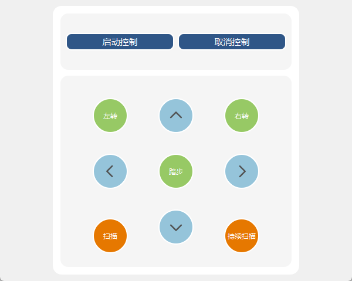


7.语音控制

在/home/lemon/exec_scripts/路径下创建largeModel.sh，将need_change_code下的该文件内容添加进去，并chmod +x largeModel.sh

点击语音控制按钮即可开启语音功能,机器人端新建终端显示信息

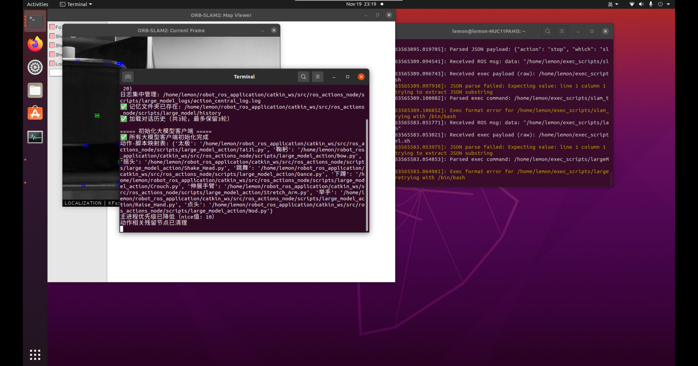


9.模型显示

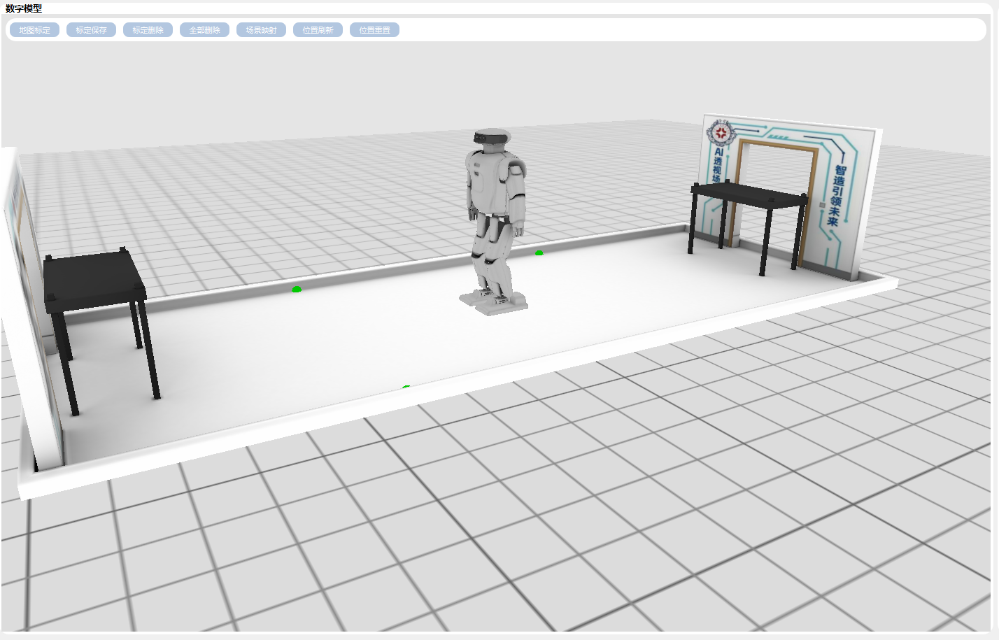

启动slam后，平台会接收ros的/initialpose话题数据，包括（x,y,yaw）。

**场景坐标映射预处理**

按照需要移动机器人到场景对应位置，左键点击地图上，点击地图标定，生成绿色标记点，依次操作生成四个标记点；点击标定保存，保存点位信息到config/calib_points.json。

点击场景映射，即可将四个绿色标记点围成的区域的场景坐标和实际机器人位置进行映射对应。右键绿色标记点，可显示其场景坐标和实机slam坐标。

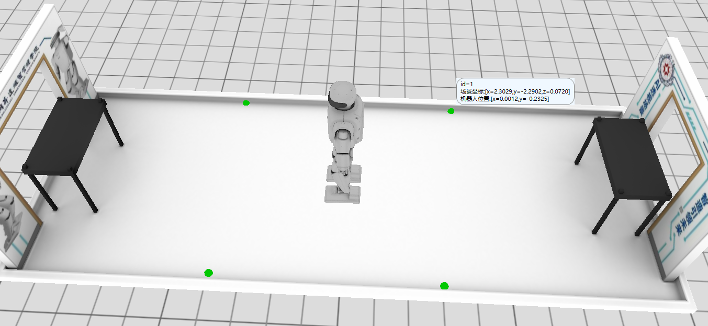

选中对应的标记点，点击标定删除，可删除标记点，退出程序前需点击保存；点击全部删除，将删除地图上全部标记点。

位置刷新按钮可将机器人模型移动到实机在场景中的对应位置

位置重置按钮可将机器人模型重置到场景中心

**模型动画与显示**


从机器人端接收/MediumSize/BodyHub/ServoPositions话题伺服电机数据，驱动fbx模型的骨骼显示动画效果

从机器人端接收/gaitCommand话题数据【x,y,delta】,根据当前位置与【x,y,delta】计算，决定位置与旋转角度的刷新显示。

修改robotManager中的m_gaitScale参数，可决定模型移动的距离的显示缩放。

10.任务列表添加

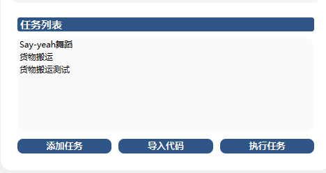

双击任务列表的具体任务，显示任务的具体信息;

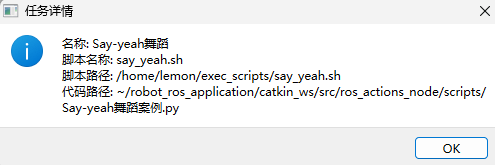

右键任务列表的任务，可选择执行，停止，编辑，删除任务

添加任务按钮，输入任务名称，脚本名称，脚本路径和代码路径，创建对应的任务，并保存到配置文件。同时会在机器人端的exec_scripts文件夹中创建对应的sh脚本。

(**代码路径示例：/home/lemon/robot_ros_application/catkin_ws/src/ros_actions_node/scripts/Say-yeah舞蹈案例.py**)

11.多机通信

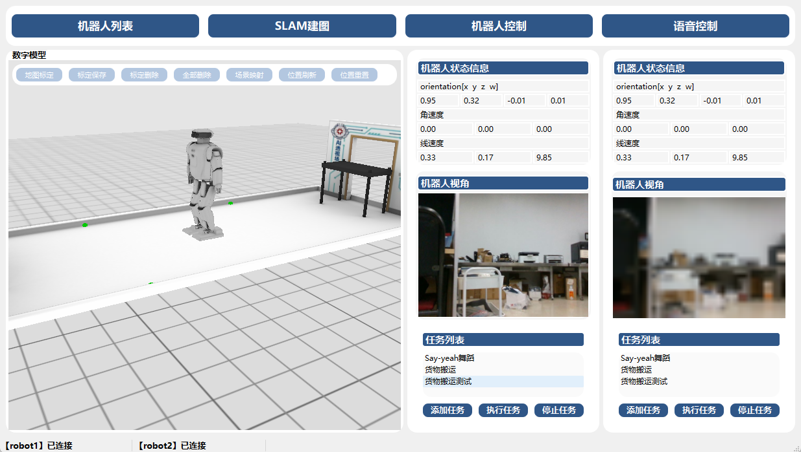

通过MultiRobotManager管理多台机器人的资源，通过连接设置对话框连接robot1和robot2，当robot2连接成功时，主界面右侧会展开一列信息显示robot2的IMU信息，图像信息，以及任务列表。

