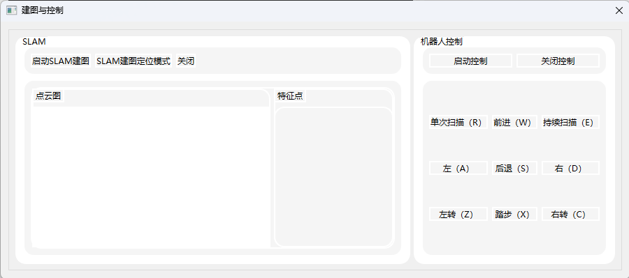

# 上位机

## 功能：

1. 数据通信
   
    (1) 基于rosBridge和QWebSocket进行ros和windows端qt软件的数据桥接

    (2) 机器人IP和端口信息数据库存储

2. 机器人基本信息

	(1) 从ros话题获取机器人位姿信息（oritation, lin_vel, ang_vel）

	(2) 实时显示机器人摄像头画面
	
	(3) SLAM建图定位模式和非定位模式切换，点云数据显示，特征点图显示

	(4) 机器人控制

3. 数字孪生显示

	机器人模型行为显示

## TODO:

	机器人模型显示

	日志功能

	slam建图时位置信息的输出显示

## 使用教程

主界面


1.通信连接

在roban上新开终端启动ros_bridge，qt程序上通过QWebSocket进行连接

```c++
 roslaunch rosbridge_server rosbridge_websocket.launch
```
点击主界面连接设置，进入连接设置界面，输入连接网络ipv4地址和端口号（ros_bridge默认端口9090），可通过添加将数据保存至数据库中，选中表单中的项，可对数据进行删除。

勾选需要连接的ip前的复选框，点击连接即可建立通信。连接成功，主界面左下方的状态栏显示已连接。


2.电量显示

状态栏显示电池电量


3.IMU数据显示
右侧信息栏显示机器人位姿信息，包括oritention, linear_acceleration,angular_velocity

将need_change_code中的SensorHubNode.py替换到机器人端的~/robot_ros_application/catkin_ws/src/sensorhub/scripts路径下的SensorHubNode.py,并编译
```
python3 -m py_compile /home/lemon/robot_ros_application/catkin_ws/src/sensorhub/scripts/SensorHubNode.py
```

4.相机图像显示

实时接收机器人相机数据进行显示

5.SLAM与控制启动



左侧界面为SLAM的初始建图模式、定位模式启动、关闭SLAM建图按钮，下方包括点云数据图和特征图显示

**运行前需要：**

将need_change_code文件夹下的MapDrawer.cc,Viewer.cc覆盖到机器人端的SLAM包下的ORB_SLAM2/src文件夹下的对应内容,MapDrawer.h和Viewer.h覆盖到ORB_SLAM2/include文件夹下。

重新编译SLAM包，若编译失败可执行下面指令

```
cd /home/lemon/robot_ros_application/catkin_ws && catkin_make -DCATKIN_WHITELIST_PACKAGES="" --force-cmake --pkg SLAM -j4
```

然后对相应的sh脚本进行读写权限修改
```
chmod +x /home/lemon/slam.sh
chmod +x /home/lemon/slam_tt.sh
chmod +x /home/lemon/move.sh
```

将need_change_code文件夹中的cmd_executor.py添加到机器人系统的~/robot_ros_application/catkin_ws/src/bodyhub/scripts中），并启动使其接受传过去的cmd指令


初次添加需要进行编译
```
python3 -m py_compile /home/lemon/robot_ros_application/catkin_ws/src/bodyhub/scripts/cmd_executor.py
```

启动指令执行脚本
```
rosrun bodyhub cmd_executor.py 
```

**使用：**


启动slam建图按钮对应指令——rosrun SLAM RGBD true false：适用于初次建图，点击关闭按钮，可结束建图并保存地图

SLAM建图定位模式对应指令——rosrun SLAM RGBD true true：适用于在之前的地图上进行二次建图，点击关闭按钮，可结束建图并保存地图。

点击按钮后会弹出定位模式开始按钮复选框，效果和机器人端显示界面里的localization按钮功能一样。

点云图显示界面，鼠标左键按住可拖动画面，右键按住可旋转视角，滚轮缩放画面大小


7.键盘控制

**使用前需要修改：**
将need_change_code文件夹下的slam_map.py内容覆盖到机器人系统的以下路径的slam_map.py

```
~/robot_ros_application/catkin_ws/src/ros_actions_node/scripts/game/2022/caai_roban_challenge/colleges/scripts
```
使用时确保脚本cmd_executor.py处于运行状态
```
rosrun bodyhub cmd_executor.py 
```

点击启动控制，通过点击界面中的按钮或按键盘上的快捷键，将控制机器人移动。


8.语音控制

在/home/lemon路径下创建largeModel.sh，将need_change_code下的该文件内容添加进去，并chmod +x largeModel.sh

点击语音控制按钮即可开启语音功能

**TODO:成功唤醒的提示待添加**


9.待更新模型显示，日志等信息输出功能